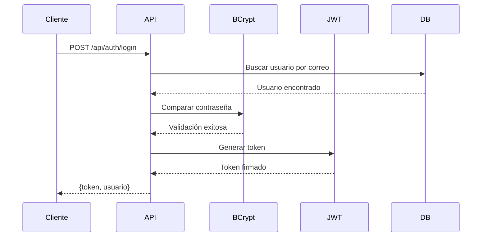
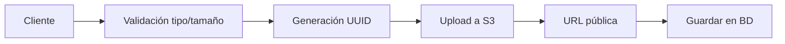

# Documento de Seguridad y Privacidad
## Sistema de Gestión de Espacios Deportivos

---

## 📋 Información General

| Aspecto | Detalle |
|---------|---------|
| **Sistema** | Backend de Gestión de Espacios Deportivos |
| **Tecnología** | NestJS + TypeScript + PostgreSQL |
| **Fecha** | Diciembre 2025 |
| **Versión** | 1.1.0 |
| **Autor** | Enrique Rafael Fernandez |

---

## 🔐 1. Autenticación y Autorización

### 1.1 Sistema de Autenticación

El sistema implementa autenticación basada en **JSON Web Tokens (JWT)** con las siguientes características:

#### Características Principales

- **Algoritmo**: JWT con firma HMAC
- **Tokens de Acceso**: Expiración configurable (1 hora por defecto)
- **Tokens de Refresh**: Expiración extendida (7 días por defecto)
- **Secretos**: Almacenados en variables de entorno

#### Flujo de Autenticación



#### Implementación de Seguridad

```typescript
// Hash de contraseñas con bcrypt
- Rounds de hash: 10 (configuración segura)
- Almacenamiento: Solo hash en BD, nunca texto plano
- Validación: Comparación segura con bcrypt.compare()
```

### 1.2 Sistema de Autorización por Roles

#### Roles Definidos

| Rol | Descripción | Permisos Principales |
|-----|-------------|---------------------|
| **ADMIN** | Administrador del sistema | Acceso total, gestión de verificaciones |
| **DUENIO** | Propietario de sedes deportivas | Gestión de sedes, canchas, análisis |
| **CLIENTE** | Usuario final | Reservas, calificaciones, favoritos |
| **CONTROLADOR** | Personal de control | Validación de pases de acceso |

#### Guards Personalizados

```typescript
// Protección de endpoints con decorador @Auth
@Auth([TipoRol.ADMIN, TipoRol.DUENIO])
@Get('dashboard')
getDashboard(@ActiveUser() user: ActiveUserPayload) {
  // Solo accesible por ADMIN o DUENIO
}
```

#### Características de Autorización

- ✅ Guards basados en roles para protección de endpoints
- ✅ Decorador `@Auth()` para declaración de permisos
- ✅ Extracción automática de usuario activo con `@ActiveUser()`
- ✅ Validación de permisos a nivel de controlador
- ✅ Manejo de roles múltiples por usuario (tabla `usuario_rol`)

---

## 🔒 2. Protección de Datos Personales

### 2.1 Datos Sensibles Almacenados

#### Información Personal

| Categoría | Datos | Protección |
|-----------|-------|------------|
| **Identificación** | Nombres, apellidos, documento | Validación estricta |
| **Contacto** | Correo electrónico, teléfono | Verificación de email |
| **Autenticación** | Contraseñas | Hash bcrypt (solo) |
| **Financiero** | Transacciones, montos | Registro inmutable |
| **Documentos** | Licencias de operación | AWS S3 privado |

### 2.2 Medidas de Protección

#### Encriptación de Contraseñas

```typescript
// Proceso de registro
const hashedPassword = await bcrypt.hash(password, 10);
// Nunca se almacena la contraseña en texto plano
```

- **Algoritmo**: bcrypt con 10 rounds de salting
- **Almacenamiento**: Campo `hashContrasena` en tabla `Usuario`
- **Recuperación**: NO es posible recuperar contraseñas, solo resetear

#### Validación y Sanitización

```typescript
// Uso de class-validator para validación automática
@ValidationPipe({
  whitelist: true,           // Elimina propiedades no definidas
  forbidNonWhitelisted: true, // Rechaza propiedades extra
  transform: true,            // Transforma tipos automáticamente
})
```

**Validaciones Implementadas:**
- ✅ Formato de correo electrónico
- ✅ Longitud y complejidad de contraseñas
- ✅ Formato de documentos de identidad
- ✅ Tipos de datos numéricos (montos, IDs)
- ✅ Rangos de fechas para reservas

#### Soft Delete

El sistema implementa **borrado lógico** en entidades críticas:

```typescript
// Entidades con soft delete
- Usuarios
- Personas
- Sedes
- Canchas
- Reservas
```

**Beneficios:**
- Preservar historial para auditorías
- Recuperación de datos accidental
- Mantener integridad referencial
- Cumplimiento de regulaciones

### 2.3 Verificación de Email

```typescript
// Sistema de verificación de correo electrónico
- Token único generado con UUID
- Expiración: 30 minutos (configurable)
- Almacenamiento: Tabla usuario_email_verificacion
- Estado: Campo booleano en Usuario
```

---

## 🌐 3. Seguridad en Comunicaciones

### 3.1 Configuración CORS

```typescript
app.enableCors({
  origin: process.env.CORS_ORIGIN || '*',
  credentials: true,
});
```

**Configuración Recomendada:**
- **Desarrollo**: `http://localhost:5173` (frontend local)
- **Producción**: Dominio específico del frontend
- **Credentials**: Habilitado para cookies/sesiones

> [!WARNING]
> En producción, NUNCA usar `origin: '*'`. Configurar el dominio específico del frontend.

### 3.2 Headers de Seguridad con Helmet

```typescript
import helmet from 'helmet';
app.use(helmet());
```

**Headers Configurados:**
- `X-Content-Type-Options: nosniff`
- `X-Frame-Options: DENY`
- `X-XSS-Protection: 1; mode=block`
- `Strict-Transport-Security` (para HTTPS)

### 3.3 SSL/TLS en Producción

**Recomendaciones:**

| Componente | Configuración SSL |
|------------|-------------------|
| **API Backend** | HTTPS con certificado (Let's Encrypt) |
| **PostgreSQL** | SSL habilitado (`DB_SSL=true`) |
| **S3** | HTTPS por defecto en AWS |
| **WebSocket** | WSS (WebSocket Secure) |

---

## 📁 4. Gestión Segura de Archivos

### 4.1 AWS S3 - Almacenamiento

#### Estructura de Carpetas

```
bucket-name/
├── canchas/{idCancha}/
│   ├── uuid1.jpg
│   └── uuid2.png
├── sedes/{idSede}/
│   └── uuid3.jpg
├── usuarios/{idUsuario}/
│   └── avatar-uuid.jpg
└── licencias/{idSede}/
    └── licencia-uuid.pdf
```

#### Seguridad S3

**Autenticación:**
- **Local**: Credenciales IAM (AWS_ACCESS_KEY_ID, AWS_SECRET_ACCESS_KEY)
- **EC2**: IAM Role automático (sin credenciales hardcodeadas)

```typescript
// Configuración adaptativa
if (accessKeyId && secretAccessKey) {
  // Modo local con credenciales
  s3Config.credentials = { accessKeyId, secretAccessKey };
} else {
  // Modo EC2 con IAM Role
  // S3Client usa automáticamente el rol de la instancia
}
```

**Políticas de Bucket:**
- Lectura pública para fotos de canchas/sedes (visualización)
- Acceso restringido para licencias y documentos
- Control de acceso por IAM roles

### 4.2 Validación de Archivos

```typescript
// Validaciones implementadas
- Tamaño máximo: 5MB (configurable)
- Tipos permitidos: JPEG, PNG, PDF
- Nombres únicos: UUID v4
- Sanitización: Extensión verificada
```

**Proceso de Upload:**



### 4.3 Eliminación Segura

```typescript
// Eliminación en cascada
1. Eliminar referencia en BD
2. Eliminar archivo de S3
3. Log de eliminación
```

---

## 📊 5. Logging y Auditoría

### 5.1 Registros de Actividad

#### Logs Implementados

| Entidad | Evento Registrado | Información |
|---------|-------------------|-------------|
| **Avatares** | Cambio de foto perfil | Usuario, URL anterior/nueva, timestamp |
| **Transacciones** | Pago procesado | Cliente, monto, estado, fecha |
| **Reservas** | Creación/Cancelación | Cliente, cancha, fechas, motivo |
| **Verificaciones** | Email verificado | Usuario, token, fecha |

### 5.2 Trazabilidad

```typescript
// Timestamps automáticos en entidades
@CreateDateColumn()
creadoEn: Date;

@UpdateDateColumn()
actualizadoEn: Date;

@DeleteDateColumn()
eliminadoEn: Date;  // Para soft delete
```

**Beneficios:**
- Auditoría completa de cambios
- Resolución de disputas
- Análisis de comportamiento
- Cumplimiento normativo

---

## 🛡️ 6. Prevención de Vulnerabilidades

### 6.1 Inyección SQL

**Protección:** TypeORM con consultas parametrizadas

```typescript
// ✅ SEGURO - TypeORM con parámetros
await repository.findOne({ where: { correo: userEmail } });

// ❌ INSEGURO - Concatenación (NO usado)
await repository.query(`SELECT * FROM usuarios WHERE correo = '${userEmail}'`);
```

### 6.2 XSS (Cross-Site Scripting)

**Medidas:**
- Validación de inputs con `class-validator`
- Sanitización automática con `whitelist: true`
- Headers de seguridad con Helmet
- Escape de HTML en respuestas (automático en JSON)

### 6.3 CSRF (Cross-Site Request Forgery)

**Protección:**
- Tokens JWT (stateless)
- CORS restrictivo en producción
- SameSite cookies (si se implementan)

### 6.4 Rate Limiting

> [!IMPORTANT]
> **Pendiente de implementación en producción**

**Recomendación:**
```typescript
// Implementar con @nestjs/throttler
@ThrottlerModule.forRoot({
  ttl: 60,
  limit: 10,
})
```

---

## ✅ 7. Cumplimiento y Buenas Prácticas

### 7.1 Checklist de Seguridad

- [x] Contraseñas hasheadas con bcrypt
- [x] Autenticación JWT implementada
- [x] Autorización por roles funcional
- [x] Validación de inputs con class-validator
- [x] CORS configurado
- [x] Helmet para headers de seguridad
- [x] SSL en producción (recomendado)
- [x] Soft delete en entidades críticas
- [x] Logging de actividades
- [x] AWS S3 con IAM roles
- [ ] Rate limiting (pendiente)
- [ ] Monitoreo con Sentry (pendiente)
- [ ] Tests de seguridad (pendiente)

### 7.2 Variables de Entorno Sensibles

**Variables críticas a proteger:**

```env
# Nunca commitear al repositorio
JWT_SECRET=***
JWT_REFRESH_SECRET=***
DB_PASSWORD=***
AWS_ACCESS_KEY_ID=*** (solo local)
AWS_SECRET_ACCESS_KEY=*** (solo local)
```

**Buenas prácticas:**
- ✅ Archivo `.env` en `.gitignore`
- ✅ Documentación en `.env.example`
- ✅ Valores diferentes por entorno (dev/prod)
- ✅ Rotación periódica de secretos

### 7.3 Principios de Diseño Seguro

#### Mínimo Privilegio

```typescript
// Usuario solo accede a sus propios recursos
async getReservas(@ActiveUser() user) {
  return this.reservasService.findByCliente(user.idCliente);
}
```

#### Defensa en Profundidad

```
Capas de seguridad:
1. Firewall / Security Groups AWS
2. HTTPS / SSL
3. CORS
4. Autenticación JWT
5. Autorización por roles
6. Validación de inputs
7. TypeORM (prevención SQL injection)
8. Logging y auditoría
```

#### Fail Securely

```typescript
// En caso de error, denegar acceso por defecto
try {
  await this.authService.verify(token);
} catch (error) {
  throw new UnauthorizedException(); // Deniega acceso
}
```

---

## 🚨 8. Recomendaciones de Producción

### 8.1 Configuraciones Críticas

```env
# Producción
NODE_ENV=production
DB_SYNCHRONIZE=false  # ⚠️ CRÍTICO: evita pérdida de datos
JWT_SECRET=<secreto-fuerte-aleatorio-min-32-chars>
CORS_ORIGIN=https://tudominio.com
DB_SSL=true
```

### 8.2 Monitoreo y Alertas

**Implementar:**
- Sentry para tracking de errores
- CloudWatch para logs AWS
- Alertas de intentos de login fallidos
- Monitoreo de uso de S3
- Alertas de picos de tráfico inusuales

### 8.3 Backups

**Estrategia:**
- Backups automáticos diarios de PostgreSQL (RDS)
- Versionado de bucket S3
- Retención: 30 días mínimo
- Tests de restauración mensuales

### 8.4 Plan de Respuesta a Incidentes

1. **Detección**: Monitoreo continuo
2. **Contención**: Bloqueo temporal de endpoints
3. **Erradicación**: Actualización de credenciales
4. **Recuperación**: Restauración desde backup
5. **Post-mortem**: Análisis y mejoras

---

## 📚 9. Conclusiones

### Fortalezas del Sistema

✅ **Autenticación robusta** con JWT y bcrypt  
✅ **Autorización granular** por roles  
✅ **Protección de datos** con validación estricta  
✅ **Almacenamiento seguro** en AWS S3  
✅ **Prevención de vulnerabilidades** comunes  
✅ **Logging completo** para auditoría  

### Áreas de Mejora

⚠️ Implementar **rate limiting** en producción  
⚠️ Agregar **autenticación de dos factores** (2FA)  
⚠️ Configurar **monitoreo con Sentry**  
⚠️ Realizar **penetration testing**  
⚠️ Documentar **plan de respuesta a incidentes**  

---

## 📞 Contacto y Soporte

Para consultas sobre seguridad o reportar vulnerabilidades:

- **GitHub**: [@kikecod](https://github.com/kikecod)
- **Proyecto**: Académico - 6to Semestre
- **Repositorio**: kikecod/espacios_deportivos

> [!CAUTION]
> Si descubres una vulnerabilidad de seguridad, repórtala de manera privada a través de GitHub Security Advisories en lugar de crear un issue público.

---

**Última actualización**: Diciembre 2025  
**Versión del documento**: 1.0  
**Estado**: Producción
