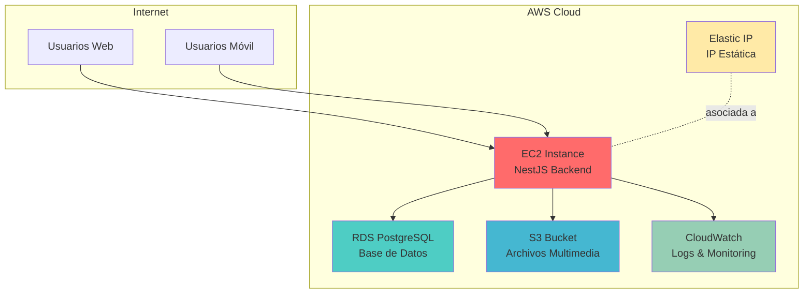
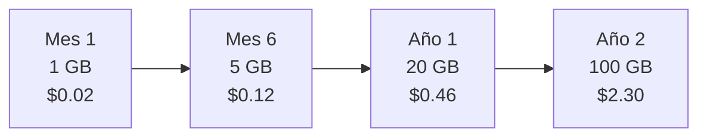
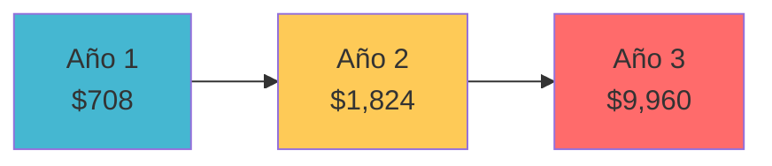

# Documento de Costos del Sistema
## Sistema de Gestión de Espacios Deportivos

---

## 📋 Información General

| Aspecto | Detalle |
|---------|---------|
| **Sistema** | Backend de Gestión de Espacios Deportivos |
| **Infraestructura** | AWS Cloud (EC2, RDS, S3) |
| **Fecha** | Diciembre 2025 |
| **Versión** | 1.1.0 |
| **Autor** | Enrique Rafael Fernandez |

---

## 🏗️ 1. Arquitectura de Infraestructura

### 1.1 Diagrama de Componentes



### 1.2 Componentes de Infraestructura

#### EC2 - Servidor de Aplicación

| Especificación | Detalle |
|----------------|---------|
| **Tipo de Instancia** | t3.medium (recomendado inicial) |
| **vCPUs** | 2 |
| **RAM** | 4 GB |
| **Almacenamiento** | 20 GB SSD (EBS gp3) |
| **Sistema Operativo** | Ubuntu Server 22.04 LTS |
| **Software** | Node.js 18+, NestJS, PM2 |

#### RDS PostgreSQL - Base de Datos

| Especificación | Detalle |
|----------------|---------|
| **Tipo de Instancia** | db.t3.micro (inicial) / db.t3.small (producción) |
| **vCPUs** | 2 |
| **RAM** | 1 GB (micro) / 2 GB (small) |
| **Almacenamiento** | 20 GB SSD (escalable) |
| **Versión PostgreSQL** | 15 |
| **Multi-AZ** | No (inicial) / Sí (producción) |

#### S3 - Almacenamiento de Archivos

| Categoría | Uso | Estimación Inicial |
|-----------|-----|-------------------|
| **Fotos de Canchas** | Múltiples por cancha | 100 MB - 1 GB |
| **Fotos de Sedes** | Imagen principal + galería | 50 MB - 500 MB |
| **Avatares de Usuarios** | Foto de perfil | 10 MB - 100 MB |
| **Licencias** | Documentos PDF | 5 MB - 50 MB |
| **Total Estimado** | Primeros 6 meses | 1 GB - 5 GB |

---

## 💰 2. Costos Mensuales Estimados

### 2.1 Costos Base (Región: US-East-1)

#### EC2 Instance (t3.medium)

```
Precio por hora: $0.0416
Precio mensual (730 horas): $30.37

Opciones de ahorro:
- On-Demand: $30.37/mes
- Reserva 1 año: $19.71/mes (-35%)
- Reserva 3 años: $12.82/mes (-58%)
```

#### RDS PostgreSQL

| Configuración | Precio Mensual | Recomendación |
|---------------|----------------|---------------|
| **db.t3.micro** | $15.26 | Desarrollo/Testing |
| **db.t3.small** | $30.51 | Producción inicial |
| **db.t3.medium** | $61.03 | Producción escalada |

**Almacenamiento adicional:**
- Storage SSD (GP2): $0.115/GB/mes
- 20 GB incluidos: ~$2.30/mes

#### S3 Storage

```
Almacenamiento estándar:
- Primeros 50 GB: $0.023/GB = $1.15/mes (50 GB)
- Siguiente 450 GB: $0.0225/GB

Transferencia de datos:
- Ingreso: GRATIS
- Primeros 100 GB salida/mes: GRATIS
- Siguiente 10 TB: $0.09/GB
```

**Estimación Mensual S3:**
- Almacenamiento (5 GB): ~$0.12
- Transferencia (10 GB salida): $0.00 (dentro gratis)
- Requests PUT/GET (10,000): ~$0.05
- **Total S3**: ~$0.20 - $1.00/mes inicialmente

#### Elastic IP

```
Costo: GRATIS mientras esté asociada a instancia en ejecución
Costo si desasociada: $0.005/hora = $3.65/mes
```

#### CloudWatch (Opcional)

```
Logs:
- Primeros 5 GB ingestion: GRATIS
- Storage: $0.03/GB/mes
- Queries: Incluidas en capa gratuita

Estimación: $0 - $5/mes
```

### 2.2 Tabla Resumen de Costos Mensuales

| Componente | Configuración | Costo Mínimo | Costo Recomendado | Costo Escalado |
|------------|---------------|--------------|-------------------|----------------|
| **EC2** | t3.medium | $30.37 | $30.37 | $61.03 (t3.large) |
| **RDS** | db.t3.micro/small | $15.26 | $30.51 | $61.03 |
| **EBS Storage** | 20 GB SSD | $2.00 | $2.00 | $4.00 (40 GB) |
| **S3** | 5 GB + transferencia | $0.20 | $1.00 | $5.00 (50 GB) |
| **Elastic IP** | 1 IP asociada | $0.00 | $0.00 | $0.00 |
| **CloudWatch** | Logs básicos | $0.00 | $2.00 | $10.00 |
| **Transferencia Datos** | Salida Internet | $0.00 | $5.00 | $20.00 |
| | | | | |
| **TOTAL MENSUAL** | | **$47.83** | **$70.88** | **$161.06** |

> [!NOTE]
> Los costos "Mínimo" asumen bajo tráfico y 1-50 usuarios concurrentes.  
> Los costos "Recomendado" son para producción inicial con 50-200 usuarios.  
> Los costos "Escalado" son para 500+ usuarios concurrentes.

---

## 📊 3. Costos Variables

### 3.1 Tráfico de Red

#### Transferencia de Datos OUT (Internet)

| Volumen Mensual | Precio por GB | Costo Estimado |
|-----------------|---------------|----------------|
| Primeros 100 GB | GRATIS | $0.00 |
| 100 GB - 10 TB | $0.09/GB | $9.00 (por 100 GB) |
| 10 TB - 50 TB | $0.085/GB | $85.00 (por 1 TB) |

**Estimación por uso:**
- **Desarrollo/Testing**: 10 GB/mes = $0.00
- **Producción inicial**: 80 GB/mes = $0.00
- **Producción activa**: 200 GB/mes = $9.00

### 3.2 Almacenamiento S3 Escalado

#### Proyección de Crecimiento



**Cálculo:**
- 10 sedes x 5 fotos x 2 MB = 100 MB
- 50 canchas x 3 fotos x 2 MB = 300 MB
- 500 usuarios x 500 KB avatar = 250 MB
- 10 licencias x 5 MB = 50 MB
- **Total Año 1**: ~700 MB - 2 GB

### 3.3 Consultas a Base de Datos

#### RDS IOPS (Input/Output Operations)

```
Incluido con gp2 SSD:
- Baseline: 100 IOPS (para 20 GB)
- Burst: Hasta 3,000 IOPS

Costo adicional si se excede: $0.10/IOPS/mes
```

**Estimación:**
- **Tráfico bajo**: Dentro de baseline (sin costo)
- **Tráfico alto**: Considerar gp3 (previsible, $0.20/GB/mes base)

---

## 🛠️ 4. Costos de Desarrollo y Mantenimiento

### 4.1 Fase de Desarrollo

| Concepto | Costo | Observaciones |
|----------|-------|---------------|
| **Desarrollo Inicial** | $0 | Proyecto académico |
| **IDE/Herramientas** | $0 | VS Code, Git (gratis) |
| **Testing Local** | $0 | Docker local |
| **Dominio** | $12/año | .com promedio (opcional) |
| **SSL Certificate** | $0 | Let's Encrypt (gratis) |

### 4.2 Dependencias de Software

#### NPM Packages (Todas Gratuitas)

```json
Backend:
- NestJS: Gratis (MIT License)
- TypeORM: Gratis (MIT License)
- PostgreSQL: Gratis (Open Source)
- AWS SDK: Gratis (uso incluido en servicios)
- bcrypt, JWT, Helmet: Gratis
```

**Costo total de licencias**: $0

### 4.3 Mantenimiento Continuo

| Actividad | Frecuencia | Tiempo Estimado | Costo (Si Outsourced) |
|-----------|------------|-----------------|----------------------|
| **Actualizaciones npm** | Mensual | 2 horas | $50 - $100 |
| **Backups/Restauración** | Semanal | 1 hora | $25 - $50 |
| **Monitoreo** | Diario | 30 min | $300/mes |
| **Soporte Usuarios** | On-demand | Variable | $500/mes |
| **Mejoras/Features** | Trimestral | 20 horas | $1,000 - $2,000 |

> [!TIP]
> Para proyecto académico/personal, el mantenimiento lo realiza el desarrollador, **costo = $0**.  
> Para producción comercial, considerar estos costos como parte del presupuesto.

---

## 💡 5. Optimización de Costos

### 5.1 Estrategias de Ahorro Inmediatas

#### 1. Instancias Reservadas

```
EC2 t3.medium:
- On-Demand: $30.37/mes
- Reserva 1 año (pago adelantado): $19.71/mes
- Ahorro: $127.92/año (35%)

RDS db.t3.small:
- On-Demand: $30.51/mes
- Reserva 1 año: $19.83/mes
- Ahorro: $128.16/año (35%)

AHORRO TOTAL ANUAL: ~$256
```

#### 2. Auto-Scaling y Scheduling

```typescript
// Apagar instancias en horario no laboral (si aplica)
Lunes - Viernes: 8 AM - 10 PM (14 horas/día)
Fines de semana: Apagado

Ahorro potencial: 50% del costo EC2 = ~$15/mes
```

> [!WARNING]
> Solo aplicable si el servicio NO requiere disponibilidad 24/7.

#### 3. S3 Lifecycle Policies

```yaml
Política de transición:
- 0-30 días: S3 Standard
- 30-90 días: S3 Standard-IA (Infrequent Access)
- 90+ días: S3 Glacier (archivos antiguos)

Ahorro en storage: 40-60% para archivos antiguos
```

### 5.2 Optimizaciones Técnicas

#### Implementar Caché

```typescript
// Redis en mismo EC2 (sin costo adicional)
import { CacheModule } from '@nestjs/cache-manager';

// Reducir consultas a RDS en 60-80%
// Ahorra IOPS y permite usar instancia menor
```

**Impacto:**
- Reducir RDS de db.t3.small → db.t3.micro
- **Ahorro**: $15.25/mes

#### Compresión de Imágenes

```typescript
// Usar Sharp para optimización
import sharp from 'sharp';

await sharp(file.buffer)
  .resize(1920, 1080, { fit: 'inside' })
  .jpeg({ quality: 80 })
  .toBuffer();

// Reduce tamaño S3 en 50-70%
```

**Impacto:**
- 5 GB → 1.5 GB storage
- **Ahorro**: ~$0.10/mes (escala con volumen)

#### CDN para Assets (CloudFront)

```
Solo si tráfico > 500 GB/mes:
- CloudFront: $0.085/GB vs S3 directo $0.09/GB
- Mejora velocidad + reduce costos
```

### 5.3 Monitoreo de Costos

#### AWS Cost Explorer

```
Configurar alertas:
- Presupuesto mensual: $80
- Alerta al 80%: $64
- Alerta al 100%: $80
```

#### Cost Tags

```typescript
// Etiquetar recursos
Project: espacios-deportivos
Environment: production
Owner: kikecod
CostCenter: backend
```

**Beneficio:** Rastrear costos por componente y optimizar selectivamente.

---

## 📈 6. Proyección de Costos

### 6.1 Escenarios de Crecimiento

#### Escenario 1: Startup (50-200 usuarios)

```
Mes 1-6:
- EC2 t3.medium: $30/mes
- RDS db.t3.micro: $15/mes
- S3: $1/mes
- Otros: $5/mes
TOTAL: $51/mes x 6 = $306

Mes 7-12:
- EC2 t3.medium: $30/mes
- RDS db.t3.small: $30/mes
- S3: $2/mes
- Transferencia: $5/mes
TOTAL: $67/mes x 6 = $402

COSTO PRIMER AÑO: $708
```

#### Escenario 2: Crecimiento (500-1,000 usuarios)

```
Año 2:
- EC2 t3.large: $61/mes
- RDS db.t3.medium: $61/mes
- S3: $5/mes
- Transferencia: $15/mes
- CloudWatch: $10/mes
TOTAL: $152/mes

COSTO ANUAL: $1,824
```

#### Escenario 3: Escalado (5,000+ usuarios)

```
Año 3+:
- EC2 t3.xlarge x2 (Load Balancer): $250/mes
- RDS db.r5.large (Multi-AZ): $350/mes
- S3: $30/mes
- Transferencia: $100/mes
- CloudFront CDN: $50/mes
- Otros: $50/mes
TOTAL: $830/mes

COSTO ANUAL: $9,960
```

### 6.2 Gráfica de Crecimiento



---

## 💼 7. Costo Total de Propiedad (TCO)

### 7.1 Comparativa: Cloud vs On-Premise

| Concepto | AWS Cloud (Año 1) | Servidor Propio |
|----------|-------------------|-----------------|
| **Hardware** | $0 | $1,500 (servidor + 3 años vida útil = $500/año) |
| **Infraestructura** | $708 | $0 |
| **Electricidad** | $0 | $200/año |
| **Internet** | Incluido | $600/año (IP estática business) |
| **Mantenimiento** | Incluido | $300/año |
| **Backups** | $50 | $200 (discos externos) |
| **Uptime/SLA** | 99.9% garantizado | 95% (sin redundancia) |
| | | |
| **TOTAL AÑO 1** | **$758** | **$1,800** |

> [!IMPORTANT]
> AWS Cloud es **2.4x más económico** en el primer año y ofrece mejor disponibilidad.

### 7.2 Costos Ocultos Evitados

**Con AWS Cloud:**
- ✅ Sin inversión inicial en hardware
- ✅ Sin costos de refrigeración/espacio físico
- ✅ Escalabilidad inmediata sin nueva inversión
- ✅ Backups automáticos EBS/RDS
- ✅ Actualizaciones de seguridad gestionadas (RDS)
- ✅ Soporte 24/7 de AWS (tier gratuito)

---

## 📋 8. Resumen Ejecutivo

### 8.1 Costos Recomendados por Fase

| Fase | Duración | Configuración | Costo Mensual | Costo Total |
|------|----------|---------------|---------------|-------------|
| **Desarrollo** | 3 meses | t3.small + db.t3.micro | $25 | $75 |
| **Testing/QA** | 2 meses | t3.medium + db.t3.micro | $45 | $90 |
| **Producción Inicial** | 6 meses | t3.medium + db.t3.small | $70 | $420 |
| **Producción Estable** | 12 meses | t3.medium + db.t3.small | $70 | $840 |
| | | | | |
| **TOTAL 2 AÑOS** | 23 meses | | | **$1,425** |

### 8.2 Recomendaciones Finales

#### Para Proyecto Académico

```
Configuración Mínima Viable:
- EC2 t3.small: $15/mes
- RDS db.t3.micro: $15/mes
- S3: $1/mes
TOTAL: $31/mes

Usar AWS Free Tier (12 meses):
- 750 horas EC2 t2.micro GRATIS
- 750 horas RDS db.t2.micro GRATIS
- 5 GB S3 GRATIS
COSTO PRIMER AÑO: $0 - $50
```

#### Para Producción Comercial

```
Configuración Recomendada:
- EC2 t3.medium (reserva 1 año): $20/mes
- RDS db.t3.small (reserva 1 año): $20/mes
- S3 + CloudFront: $5/mes
- Monitoreo: $5/mes
TOTAL: $50/mes = $600/año

+ Presupuesto emergencia: $200/año
TOTAL CON CONTINGENCIA: $800/año
```

---

## 🎯 9. Plan de Acción

### 9.1 Checklist de Implementación

- [ ] **Mes 1**: Crear cuenta AWS y configurar Free Tier
- [ ] **Mes 1**: Implementar monitoreo de costos (AWS Budgets)
- [ ] **Mes 2-3**: Ejecutar en Free Tier para validar
- [ ] **Mes 4**: Migrar a t3.medium + db.t3.small
- [ ] **Mes 6**: Evaluar reservas de instancias (ahorro 35%)
- [ ] **Mes 6**: Implementar caché Redis
- [ ] **Mes 12**: Revisar métricas y ajustar tamaño instancias
- [ ] **Continuo**: Optimizar imágenes S3 con lifecycle policies

### 9.2 KPIs de Costo

| Métrica | Objetivo | Alerta |
|---------|----------|--------|
| **Costo/Usuario/Mes** | < $0.50 | > $1.00 |
| **% Costo S3 vs Total** | < 10% | > 20% |
| **% Costo Transferencia** | < 15% | > 30% |
| **Uptime** | > 99.5% | < 99% |

---

## 📚 10. Conclusiones

### Ventajas del Modelo AWS

✅ **Bajo costo inicial**: Sin inversión en hardware  
✅ **Escalabilidad**: Crece con la demanda  
✅ **Gestión simplificada**: Menos mantenimiento  
✅ **Alta disponibilidad**: SLA 99.9%  
✅ **Seguridad**: Certificaciones ISO, SOC, PCI-DSS  

### Costos Estimados Finales

| Escenario | Costo Mensual | Costo Anual |
|-----------|---------------|-------------|
| **Académico (Free Tier)** | $0 - $10 | $0 - $120 |
| **Startup (100 usuarios)** | $50 - $70 | $600 - $840 |
| **Producción (500 usuarios)** | $120 - $160 | $1,440 - $1,920 |
| **Escalado (5,000+ usuarios)** | $500 - $1,000 | $6,000 - $12,000 |

> [!TIP]
> Para el contexto de proyecto académico, **aprovechar AWS Free Tier** permite operar con $0 - $50 en el primer año.

---

## 📞 Contacto

Para consultas sobre costos o arquitectura:

- **GitHub**: [@kikecod](https://github.com/kikecod)
- **Proyecto**: Académico - 6to Semestre
- **Repositorio**: kikecod/espacios_deportivos

---

**Última actualización**: Diciembre 2025  
**Versión del documento**: 1.0  
**Región AWS**: US-East-1 (Virginia)  
**Moneda**: USD
