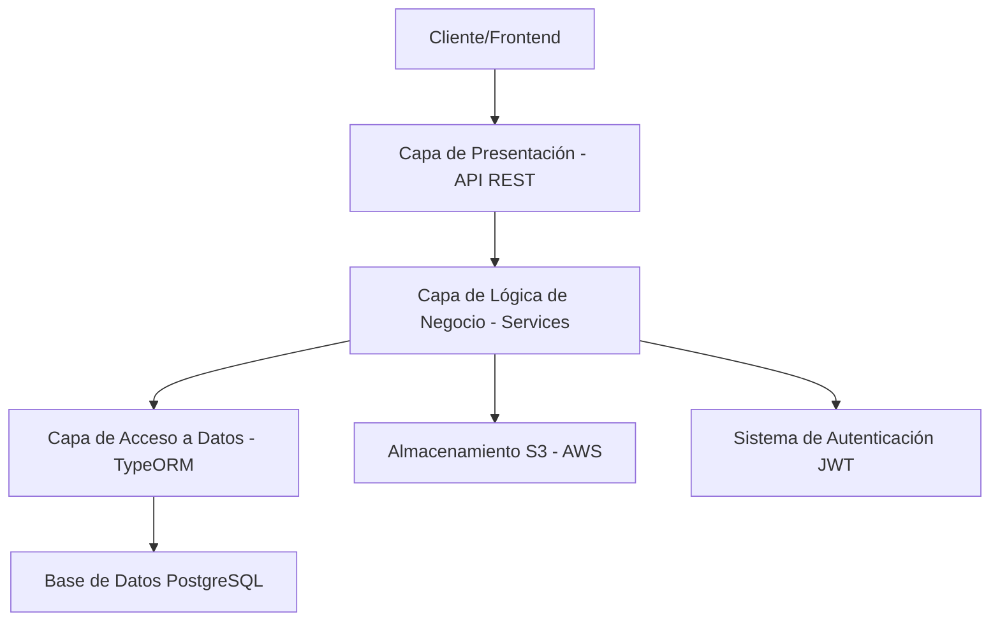
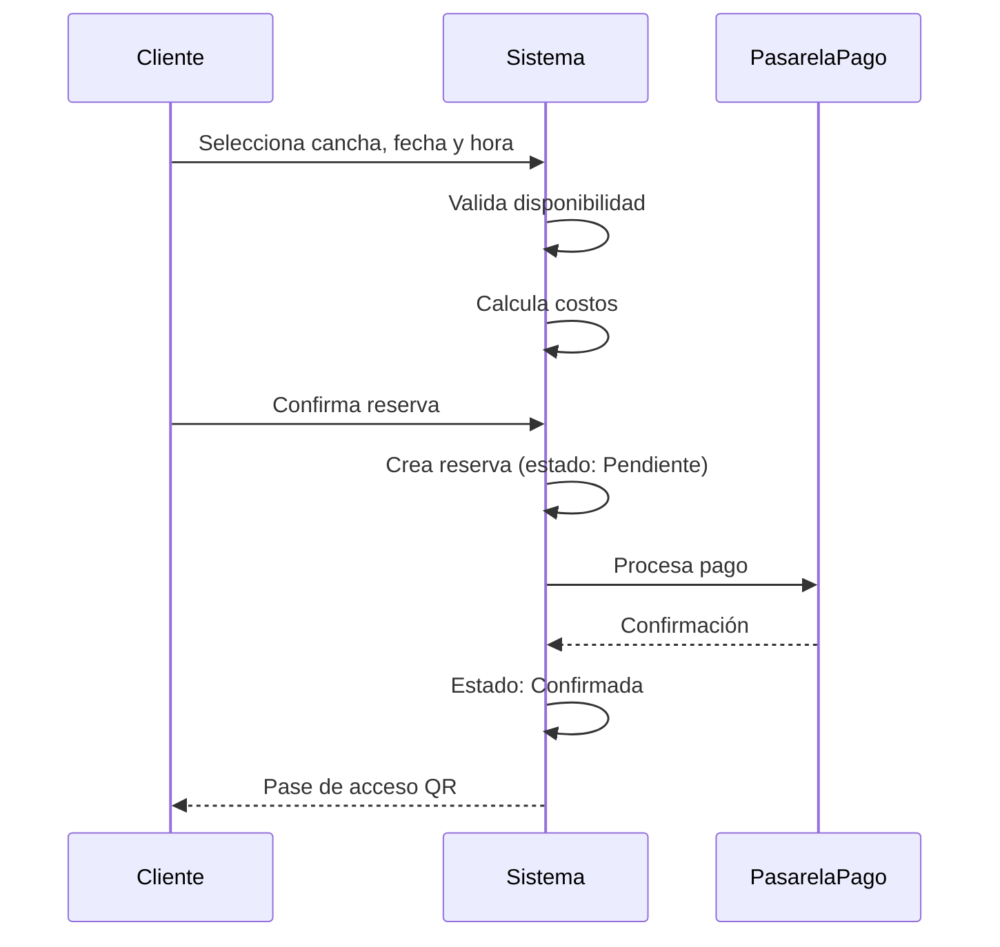
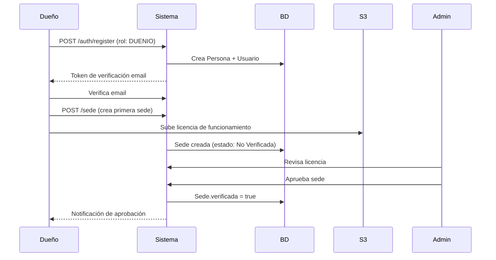
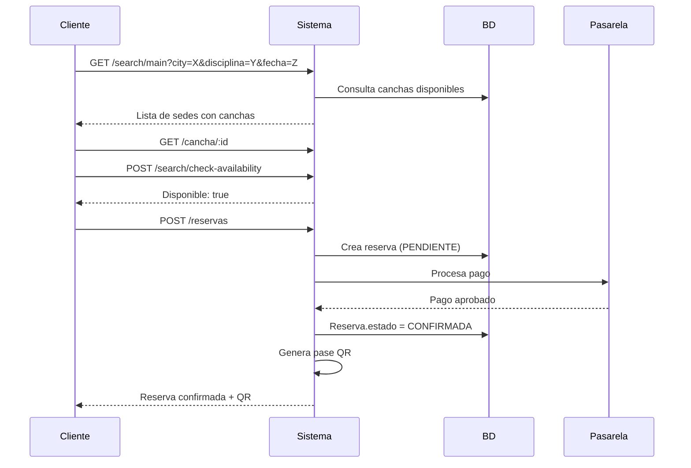
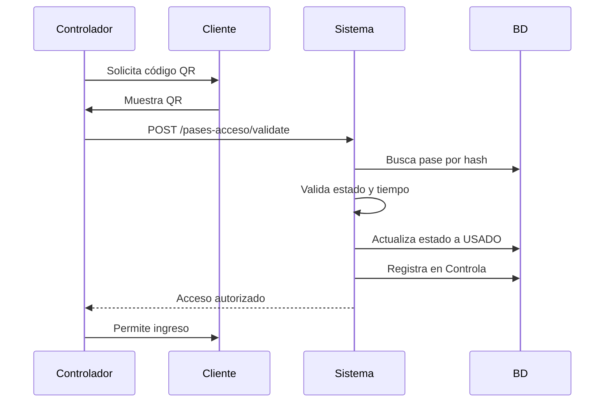
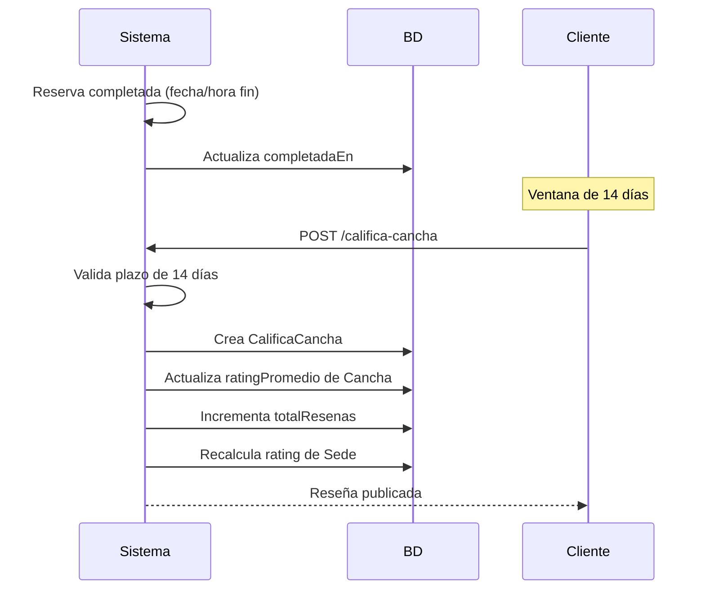
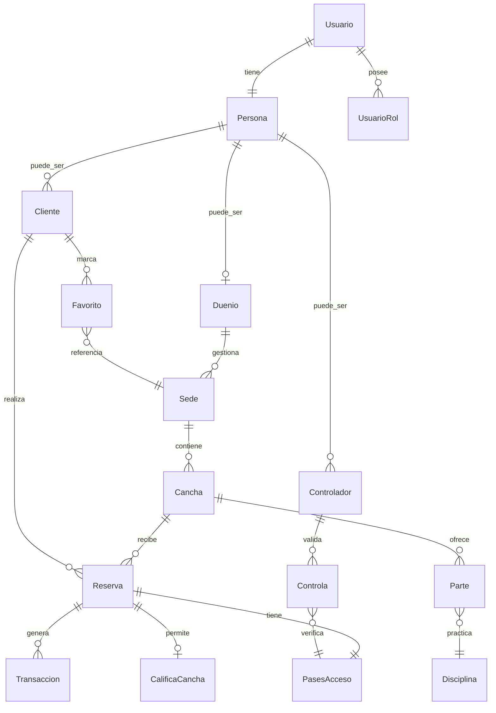

# Descripción Funcional del Sistema
## Sistema de Gestión de Espacios Deportivos

---

## 📋 Información General

| Aspecto | Detalle |
|---------|---------|
| **Sistema** | Backend de Gestión de Espacios Deportivos |
| **Tecnología** | NestJS + TypeScript + PostgreSQL + AWS S3 |
| **Fecha** | Diciembre 2025 |
| **Versión** | 1.1.0 |
| **Autor** | Enrique Rafael Fernandez |
| **Arquitectura** | API REST con microservicios modulares |

---

## 🎯 Descripción General del Sistema

El Sistema de Gestión de Espacios Deportivos es una **plataforma integral** diseñada para facilitar la reserva, administración y gestión de instalaciones deportivas. Proporciona una API REST completa que conecta a:

- **Clientes**: Usuarios que buscan y reservan espacios deportivos
- **Dueños**: Propietarios que administran sus sedes y canchas
- **Controladores**: Personal encargado de validar accesos mediante códigos QR
- **Administradores**: Gestores del sistema que supervisan y verifican operaciones

### Objetivo Principal

Digitalizar y optimizar la gestión completa del ciclo de vida de reservas deportivas, desde la búsqueda y reserva hasta el pago, control de acceso y evaluación post-servicio.

---

## 🏗️ Arquitectura del Sistema

### Modelo de Capas



### Estructura Modular

El sistema está organizado en **37 módulos independientes** pero interconectados:

```
📦 Backend
├── 🔐 Autenticación y Autorización (auth, usuarios, personas, roles)
├── 👥 Gestión de Perfiles (clientes, duenio, controlador, profile)
├── 🏢 Gestión de Instalaciones (sede, cancha, disciplina, fotos)
├── 📅 Sistema de Reservas (reservas, cancelacion, transacciones)
├── ⭐ Sistema de Calificaciones (califica_cancha, califica_sede)
├── 🔍 Búsqueda y Filtrado (search)
├── 💖 Favoritos (favorito)
├── 🎫 Control de Acceso (pases_acceso, controla)
├── 📊 Reportes y Analytics (analytics, reportes, dashboard)
├── 🚨 Seguridad (denuncia)
└── 📧 Comunicaciones (mails, websocket)
```

---

## 👥 Actores del Sistema

### 1. Cliente

**Descripción**: Usuario final que busca, reserva y utiliza espacios deportivos.

**Funcionalidades principales**:
- Registro y autenticación
- Búsqueda avanzada de sedes y canchas
- Gestión de reservas
- Procesamiento de pagos
- Evaluación de servicios (reseñas)
- Gestión de favoritos
- Visualización de historial
- Recepción de pases de acceso QR

### 2. Dueño (Propietario)

**Descripción**: Propietario de una o múltiples sedes deportivas.

**Funcionalidades principales**:
- Registro con verificación de licencias
- Gestión completa de sedes
- Administración de canchas
- Configuración de precios y horarios
- Carga y gestión de fotografías
- Panel de analytics y métricas
- Gestión de reportes financieros
- Aprobación/rechazo de reservas

### 3. Controlador

**Descripción**: Personal encargado de validar accesos a las instalaciones.

**Funcionalidades principales**:
- Escaneo y validación de códigos QR
- Registro de accesos
- Consulta de reservas activas
- Validación de identidad

### 4. Administrador

**Descripción**: Gestor del sistema con acceso total.

**Funcionalidades principales**:
- Verificación de licencias de funcionamiento
- Gestión de usuarios y roles
- Supervisión de denuncias
- Acceso a métricas globales del sistema
- Moderación de contenido
- Gestión de disciplinas deportivas

---

## 📦 Módulos Funcionales Detallados

### 1. Módulo de Autenticación y Autorización

#### Descripción
Sistema robusto de autenticación basado en **JWT (JSON Web Tokens)** con manejo de roles múltiples.

#### Funcionalidades

**1.1 Registro de Usuarios**
- Creación de cuenta con datos personales
- Selección de rol inicial (Cliente/Dueño/Controlador)
- Hash de contraseñas con bcrypt (10 rounds)
- Generación de token de verificación de email
- Validación estricta de datos de entrada

**1.2 Inicio de Sesión**
- Autenticación por correo electrónico y contraseña
- Generación de access token (1 hora) y refresh token (7 días)
- Actualización de timestamp de último acceso
- Validación de estado de cuenta (activo/bloqueado)

**1.3 Gestión de Sesiones**
- Renovación de tokens
- Cierre de sesión
- Cambio de contraseña
- Recuperación de contraseña (en desarrollo)

**1.4 Control de Acceso por Roles**
```typescript
Roles disponibles:
- ADMIN: Acceso total al sistema
- DUENIO: Gestión de sedes y canchas
- CLIENTE: Reservas y calificaciones
- CONTROLADOR: Validación de accesos
```

#### Entidades Principales
- `Usuario`: Credenciales y estado de cuenta
- `Persona`: Información personal del usuario
- `Rol`: Definición de roles del sistema
- `UsuarioRol`: Relación usuario-roles (muchos a muchos)
- `UsuarioEmailVerificacion`: Tokens de verificación de email
- `UsuarioAvatarLog`: Historial de cambios de avatar

---

### 2. Módulo de Gestión de Perfiles

#### 2.1 Perfil de Persona

**Datos almacenados**:
- Información personal: nombres, apellidos, fecha de nacimiento
- Documentación: tipo y número de documento
- Contacto: teléfono, dirección, ciudad, país
- Preferencias: ocupación, deportes favoritos, biografía
- Avatar/foto de perfil (almacenado en S3)

**Funcionalidades**:
- Actualización de información personal
- Carga y cambio de avatar
- Verificación de teléfono (booleano)
- Soft delete para preservar historial

#### 2.2 Perfil de Cliente

**Funcionalidades**:
- Visualización de reservas activas
- Historial completo de reservas
- Gestión de favoritos
- Gestión de calificaciones emitidas
- Estadísticas personales (reservas totales, gasto total)

#### 2.3 Perfil de Dueño

**Funcionalidades**:
- Gestión de múltiples sedes
- Panel de control con métricas
- Gestión financiera
- Configuración de equipos (controladores)

---

### 3. Módulo de Gestión de Sedes

#### Descripción
Gestión completa de complejos deportivos (sedes) con información detallada y geolocalización.

#### Funcionalidades

**3.1 Creación de Sede**
- Información básica: nombre, descripción, políticas
- Datos de contacto: teléfono, email
- **Ubicación geográfica universal**:
  - País (country), código de país (countryCode)
  - Estado/Provincia (stateProvince)
  - Ciudad (city)
  - Distrito/zona (district)
  - Dirección completa (addressLine)
  - Código postal (postalCode)
  - Coordenadas GPS (latitude, longitude)
  - Zona horaria (timezone)
- Documentación legal:
  - NIT (Número de Identificación Tributaria)
  - Licencia de funcionamiento (archivo almacenado en S3)
- Estado inicial: "No Verificada"

**3.2 Gestión de Fotografías**
- Carga múltiple de imágenes (AWS S3)
- Tipos: foto principal, galería
- Ordenamiento de fotos
- Eliminación segura (borrado de S3 + BD)

**3.3 Verificación de Sede**
- **Proceso de verificación administrativa**:
  1. Dueño sube licencia de funcionamiento
  2. Administrador revisa documentación
  3. Aprobación/rechazo con notificación
  4. Estado cambia a "Verificada"
- Solo sedes verificadas aparecen en búsquedas públicas

**3.4 Gestión de Estado**
- Estados: Activa, Inactiva, Verificada, No Verificada
- Desactivación temporal (inactivo)
- Soft delete para preservar historial

**3.5 Sistema de Calificación**
- Rating promedio de la sede (calculado a partir de canchas)
- Total de reseñas
- Rating final (híbrido sede + canchas)

#### Entidades
- `Sede`: Información completa del complejo deportivo
- `Foto`: Imágenes asociadas

---

### 4. Módulo de Gestión de Canchas

#### Descripción
Administración detallada de espacios deportivos individuales dentro de una sede.

#### Funcionalidades

**4.1 Creación y Configuración**
- **Información básica**:
  - Nombre de la cancha
  - Superficie (césped natural, sintético, cemento, madera, etc.)
  - Cubierta (booleano: techada o al aire libre)
  - Dimensiones (ej: "40m x 20m")
  - Aforo máximo
- **Configuración deportiva**:
  - Disciplinas permitidas (relación muchos a muchos con Disciplina)
- **Iluminación**: descripción del sistema de luces
- **Reglas de uso**: políticas específicas de la cancha
- **Estado**: Disponible, Mantenimiento, Fuera de servicio

**4.2 Gestión de Precios y Horarios**
- Precio base por hora
- Hora de apertura (ej: 06:00)
- Hora de cierre (ej: 23:00)
- Precios diferenciados por horario (en desarrollo)

**4.3 Gestión de Fotografías**
- Galería de imágenes de la cancha
- Almacenamiento en S3: `canchas/{idCancha}/`
- Ordenamiento y eliminación

**4.4 Sistema de Calificación**
- Rating promedio (1-5 estrellas)
- Total de reseñas
- Actualización automática con cada nueva calificación

**4.5 Disponibilidad**
- Consulta de horarios disponibles
- Validación contra reservas existentes
- Consideración de horarios de operación

#### Entidades
- `Cancha`: Información completa del espacio deportivo
- `Parte`: Relación cancha-disciplina
- `Disciplina`: Deportes disponibles (fútbol, básquet, tenis, etc.)

---

### 5. Módulo de Disciplinas Deportivas

#### Descripción
Catálogo de deportes y actividades disponibles en el sistema.

#### Funcionalidades
- CRUD de disciplinas
- Categorización (deportes de equipo, individuales, acuáticos, etc.)
- Descripción detallada
- Asociación con canchas mediante `Parte`

#### Ejemplos de Disciplinas
- Fútbol (sala, 7, 11)
- Básquet
- Vóley
- Tenis
- Pádel

---

### 6. Módulo de Reservas

#### Descripción
Sistema completo de gestión del ciclo de vida de reservas deportivas.

#### 6.1 Creación de Reserva

**Flujo de creación**:


**Datos de la reserva**:
- Cliente (idCliente)
- Cancha (idCancha)
- Fecha y hora de inicio (iniciaEn)
- Fecha y hora de fin (terminaEn)
- Cantidad de personas
- Montos:
  - Monto base (precio x duración)
  - Monto extra (servicios adicionales)
  - Monto total
- Requiere aprobación (booleano)

**Validaciones**:
- ✅ Cancha disponible en horario solicitado
- ✅ Sin conflictos con otras reservas
- ✅ Dentro del horario de operación
- ✅ Fecha futura
- ✅ Cantidad de personas ≤ aforo máximo

#### 6.2 Estados de Reserva

```
PENDIENTE → Esperando pago o aprobación
    ↓
CONFIRMADA → Pago aprobado, reserva activa
    ↓
COMPLETADA → Servicio cumplido (permite reseñas)
    ↓
CANCELADA → Cancelada por cliente/dueño
    ↓
RECHAZADA → Rechazada por dueño
```

**Transiciones automáticas**:
- Pendiente → Confirmada: Al aprobar el pago
- Confirmada → Completada: Manualmente o automáticamente después de la fecha/hora de fin

#### 6.3 Cancelación de Reservas

**Funcionalidades**:
- Cancelación por cliente (con motivo)
- Cancelación por dueño (con motivo)
- Registro en entidad `Cancelacion`:
  - Motivo de cancelación
  - Timestamp de cancelación
  - Usuario que cancela
- Reembolso según políticas (en desarrollo)

#### 6.4 Completado de Reservas

**Proceso**:
1. Reserva se marca como completada
2. Se registra `completadaEn` (timestamp)
3. **Ventana de 14 días para dejar reseña**
4. Después de 14 días, no se permite calificar

#### 6.5 Gestión de Participantes

- Entidad `Participa`: Registra quiénes asistieron
- Útil para estadísticas y control de acceso

#### Entidades
- `Reserva`: Información completa de la reserva
- `Cancelacion`: Registro de cancelaciones
- `Participa`: Participantes de la reserva
- `Controla`: Registro de validaciones de acceso

---

### 7. Módulo de Transacciones y Pagos

#### Descripción
Sistema de procesamiento y registro de pagos para reservas.

#### Funcionalidades

**7.1 Procesamiento de Pagos**
- Integración con pasarelas de pago
- Métodos soportados: tarjeta, QR, transferencia
- Estados de transacción:
  - PENDIENTE: Iniciada pero no confirmada
  - APROBADA: Pago exitoso
  - RECHAZADA: Pago fallido
  - REEMBOLSADA: Devolución procesada

**7.2 Registro de Transacciones**
- **Información almacenada**:
  - ID de reserva asociada
  - Pasarela utilizada
  - Método de pago
  - Monto total
  - Comisión de pasarela
  - Comisión de plataforma
  - Moneda liquidada
  - Código de autorización
  - ID externo (de la pasarela)
- **Timestamps**:
  - Creado en
  - Capturado en
  - Reembolsado en (si aplica)

**7.3 Historial Financiero**
- Consulta de transacciones por cliente
- Consulta de ingresos por dueño
- Reportes financieros por sede/cancha
- Exportación a CSV

#### Entidades
- `Transaccion`: Registro completo de cada pago

---

### 8. Módulo de Calificaciones y Reseñas

#### Descripción
Sistema de evaluación post-servicio para canchas y sedes.

#### 8.1 Calificación de Canchas

**Funcionalidades**:
- **Restricciones**:
  - Solo clientes con reserva completada
  - Dentro de 14 días después de `completadaEn`
  - Una reseña por cliente por cancha
- **Datos de la reseña**:
  - Puntaje (1-5 estrellas)
  - Comentario (texto opcional)
  - Relación con reserva específica
- **Estados**: ACTIVA, ELIMINADA

**Validaciones**:
```typescript
✅ Cliente tiene reserva completada
✅ Han pasado menos de 14 días
✅ No existe reseña previa
✅ Puntaje entre 1 y 5
```

**Actualización automática**:
- Recalcula `ratingPromedio` de la cancha
- Incrementa `totalResenas`
- Actualiza rating de la sede (calculado)

#### 8.2 Calificación de Sedes

**Sistema híbrido**:
- Rating promedio de todas las canchas de la sede
- Rating directo de la sede (si se implementa)
- Rating final calculado

#### 8.3 Consulta de Reseñas

**Endpoints**:
- GET /califica-cancha/cancha/:id
  - Paginación (page, limit)
  - Ordenamiento: recientes, mejores, peores
  - Filtros por puntuación
- GET /califica-cancha/:idCliente/:idCancha
  - Consulta de reseña específica

**Información incluida**:
- Datos del cliente: nombre, avatar
- Puntaje y comentario
- Fecha de creación
- Información de la reserva

#### Entidades
- `CalificaCancha`: Reseñas de canchas
- `CalificaSede`: Reseñas de sedes (en desarrollo)

---

### 9. Módulo de Pases de Acceso (QR)

#### Descripción
Sistema de códigos QR para control de acceso a reservas.

#### Funcionalidades

**9.1 Generación de Pases**
- **Proceso automático**:
  1. Al confirmar reserva, se genera pase QR
  2. Código único encriptado
  3. Hash para validación rápida
  4. Válido desde: fecha/hora de reserva - 30min
  5. Válido hasta: fecha/hora de fin
- **Datos del pase**:
  - Código QR (string codificado)
  - Hash de verificación
  - Ventana de validez
  - Uso máximo (por defecto: 1)
  - Contador de veces usado

**9.2 Estados del Pase**
```
PENDIENTE → Generado, aún no activado
ACTIVO → Dentro de ventana de validez
USADO → Ya validado en acceso
EXPIRADO → Fuera de ventana de validez
CANCELADO → Reserva cancelada
```

**9.3 Validación de Acceso**
- **Flujo de controlador**:
  1. Controlador escanea código QR
  2. Sistema valida hash
  3. Verifica estado y ventana de tiempo
  4. Registra acceso en `Controla`
  5. Actualiza estado a USADO
  6. Registra `primerUsoEn` y `ultimoUsoEn`

**9.4 Registro de Controles**
- Entidad `Controla`:
  - Controlador que validó
  - Pase de acceso
  - Reserva asociada
  - Timestamp de validación

#### Entidades
- `PasesAcceso`: Códigos QR de acceso
- `Controla`: Registro de validaciones

---

### 10. Módulo de Favoritos

#### Descripción
Sistema para que clientes marquen sedes favoritas.

#### Funcionalidades

**10.1 Gestión de Favoritos**
- Agregar sede a favoritos
- Eliminar de favoritos
- Consultar lista de favoritos
- **Datos adicionales**:
  - Notificaciones activas (booleano)
  - Etiquetas personalizadas (array de strings)
  - Notas personales (texto)

**10.2 Consulta de Favoritos**
- GET /favorito/cliente/:id
  - Lista completa de favoritos
  - Información de la sede incluida
  - Ordenamiento por fecha de agregado

**10.3 Aplicaciones**
- Acceso rápido a sedes preferidas
- Notificaciones de promociones (futuro)
- Recomendaciones personalizadas

#### Entidades
- `Favorito`: Relación cliente-sede con metadata

---

### 11. Módulo de Búsqueda y Filtrado

#### Descripción
Sistema avanzado de búsqueda de canchas y sedes con múltiples filtros.

#### 11.1 Búsqueda Principal

**Endpoint**: GET /search/main

**Filtros básicos**:
- **Ubicación**:
  - País (country)
  - Ciudad (city)
  - Distrito (district)
- **Disponibilidad**:
  - Fecha (YYYY-MM-DD)
  - Hora inicio (HH:mm)
  - Hora fin (HH:mm)
- **Disciplina**: ID o nombre del deporte
- **Paginación**: page, limit
- **Ordenamiento**: por precio, rating, nombre

**Resultado**: Lista de **SEDES** con canchas disponibles

#### 11.2 Búsqueda Avanzada

**Endpoint**: GET /search/filters

**Filtros adicionales**:
- **Precio**: precioMin, precioMax
- **Superficie**: césped, sintético, cemento, etc.
- **Características**:
  - cubierta (booleano)
  - iluminacion (tipo)
  - aforoMin, aforoMax
- **Calificación**: ratingMin

#### 11.3 Verificación de Disponibilidad

**Endpoint**: POST /search/check-availability

**Proceso**:
1. Recibe idCancha, fecha, horaInicio, horaFin
2. Consulta reservas existentes
3. Valida conflictos de horario
4. Retorna:
   - disponible (booleano)
   - conflictos (array de reservas)
   - horariosDisponibles (sugerencias)

#### 11.4 Autocompletado

**Funcionalidades**:
- GET /search/autocomplete/cities?q=text
  - Sugerencias de ciudades
- GET /search/autocomplete/districts?city=X&q=text
  - Sugerencias de distritos

#### 11.5 Información de Filtros

**Retorna metadata**:
- Ciudades disponibles
- Distritos disponibles
- Disciplinas disponibles
- Rango de precios (min, max)

#### Entidades consultadas
- `Cancha`
- `Sede`
- `Reserva`
- `Disciplina`

---

### 12. Módulo de Analytics y Reportes

#### Descripción
Sistema completo de métricas, estadísticas y reportes para dueños y administradores.

#### 12.1 Dashboard Principal

**Endpoint**: GET /analytics/dashboard

**Métricas incluidas**:

**Ingresos** (con variación mensual):
- Ingresos del mes actual
- Comparación con mes anterior
- Tendencia (↑ up / ↓ down)

**Total de Reservas** (con variación):
- Reservas del mes actual
- Comparación con mes anterior
- Tendencia

**Tasa de Ocupación**:
- Porcentaje de tiempo reservado
- Cálculo basado en horas disponibles vs ocupadas

**Rating Promedio**:
- Calificación promedio de todas las canchas
- Escala de 1 a 5

**Gráficos generados**:
1. Ingresos últimos 12 meses (línea)
2. Reservas por estado (torta/barras)
3. Reservas por día del mes (barras)
4. Horarios populares (histograma)

**Filtros disponibles**:
- Por dueño (idPersonaD)
- Por sede (idSede)
- Por cancha (idCancha)

#### 12.2 Estadísticas por Cancha

**Endpoint**: GET /analytics/cancha/:id

**Métricas específicas**:
- Total de reservas del período
- Ingresos generados
- Tasa de ocupación
- Rating promedio
- Distribución de reservas por estado
- Información de la cancha y sede

**Parámetros**:
- mes (YYYY-MM): filtro de período

#### 12.3 Ingresos Mensuales

**Endpoint**: GET /analytics/ingresos

**Funcionalidades**:
- Agrupación mensual de ingresos
- Últimos N meses (límite configurable)
- Comparación mes a mes
- Filtrado por dueño/sede/cancha

**Formato**:
```json
[
  {
    "mes": "2025-11",
    "nombreMes": "nov 2025",
    "ingresos": 15000.00
  }
]
```

#### 12.4 Resumen de Reseñas

**Endpoint**: GET /analytics/resenas

**Métricas**:
- Total de reseñas
- Rating promedio global
- Distribución por estrellas (1-5)
- Reseñas recientes

#### 12.5 Calendario de Disponibilidad

**Endpoint**: GET /analytics/calendario

**Funcionalidades**:
- Vista de calendario mensual
- Días con alta ocupación
- Días disponibles
- Sugerencias de precios dinámicos (futuro)

#### 12.6 Exportación de Datos

**Endpoint**: GET /reportes/dashboard-csv

**Funcionalidades**:
- Exportación de métricas a CSV
- Descarga de reportes financieros
- Historial de reservas
- Compatible con Excel

#### Aplicaciones
- Toma de decisiones informadas
- Optimización de precios
- Identificación de horarios pico
- Análisis de rendimiento

---

### 13. Módulo de Denuncias

#### Descripción
Sistema para reportar problemas, abusos o irregularidades.

#### Funcionalidades
- Creación de denuncias
- Asociación a sede o cancha
- Clasificación de denuncia
- Estado: Pendiente, En revisión, Resuelta, Rechazada
- Panel administrativo de denuncias

#### Entidades
- `Denuncia`: Registro de reportes

---

### 14. Módulo de Comunicaciones

#### 14.1 Email

**Funcionalidades**:
- Verificación de email
- Notificaciones de reserva
- Recordatorios (futuro)
- Confirmaciones de pago

#### 14.2 WebSocket

**Aplicaciones**:
- Notificaciones en tiempo real
- Actualizaciones de disponibilidad
- Chat de soporte (futuro)

---

### 15. Módulo Administrativo

#### Funcionalidades para Administradores

**15.1 Verificación de Licencias**
- Revisión de documentos de sedes
- Aprobación/rechazo de verificaciones
- Comentarios en proceso de verificación

**15.2 Gestión de Usuarios**
- Bloqueo/desbloqueo de cuentas
- Cambio de estados
- Moderación de contenido

**15.3 Gestión de Disciplinas**
- CRUD de deportes disponibles
- Categorización

**15.4 Monitoreo del Sistema**
- Logs de actividad
- Métricas globales
- Resolución de denuncias

---

## 🔄 Flujos de Trabajo Principales

### Flujo 1: Registro y Verificación de Dueño



### Flujo 2: Búsqueda y Reserva de Cliente



### Flujo 3: Acceso con QR



### Flujo 4: Calificación Post-Servicio



---

## 📊 Modelo de Datos

### Diagrama de Relaciones Principales



### Entidades Clave

**Entidades de Usuarios**:
- Usuario (credenciales)
- Persona (datos personales)
- Cliente, Duenio, Controlador (perfiles)
- Rol, UsuarioRol (autorización)

**Entidades de Instalaciones**:
- Sede (complejos deportivos)
- Cancha (espacios específicos)
- Disciplina (deportes)
- Parte (relación cancha-disciplina)
- Foto (imágenes)

**Entidades de Operaciones**:
- Reserva (reservaciones)
- Transaccion (pagos)
- PasesAcceso (códigos QR)
- Controla (validaciones)
- Cancelacion (cancelaciones)

**Entidades de Evaluación**:
- CalificaCancha (reseñas)
- CalificaSede (reseñas de sede)

**Entidades de Preferencias**:
- Favorito (sedes favoritas)
- UsuarioPreferencias (configuraciones)

**Entidades Administrativas**:
- Denuncia (reportes)
- UsuarioEmailVerificacion (verificación)
- UsuarioAvatarLog (auditoría)

---

## 🔧 Características Técnicas

### Validaciones de Negocio

**Reservas**:
- ✅ Sin conflictos de horario
- ✅ Dentro de horario de operación
- ✅ Aforo no excedido
- ✅ Fecha futura
- ✅ Duración mínima (configurable)

**Calificaciones**:
- ✅ Solo con reserva completada
- ✅ Dentro de 14 días
- ✅ Una reseña por cliente-cancha
- ✅ Puntaje 1-5

**Acceso QR**:
- ✅ Código no expirado
- ✅ No usado previamente
- ✅ Hash válido

### Timestamps Automáticos

Todas las entidades principales incluyen:
- `creadoEn`: Fecha de creación
- `actualizadoEn`: Última actualización
- `eliminadoEn`: Soft delete (opcional)

### Soft Delete

Entidades con borrado lógico:
- Usuario, Persona
- Sede, Cancha
- Reserva
- Denuncia

**Beneficio**: Preservar historial e integridad referencial

### Normalización de Datos

- **Ubicación**: Sistema universal (país, estado, ciudad, distrito, coordenadas GPS)
- **Montos**: Tipo decimal con precisión (10,2)
- **Ratings**: Decimal (3,2) para promedios
- **Timestamps**: Tipo timestamp con zona horaria

---

## 📡 API REST - Endpoints Principales

### Autenticación
```
POST   /api/auth/register         # Registro de usuario
POST   /api/auth/login            # Inicio de sesión
POST   /api/auth/refresh          # Renovar token
POST   /api/auth/logout           # Cerrar sesión
```

### Sedes
```
POST   /api/sede                  # Crear sede
GET    /api/sede                  # Listar sedes
GET    /api/sede/:id              # Detalle de sede
PATCH  /api/sede/:id              # Actualizar sede
DELETE /api/sede/:id              # Eliminar sede (soft)
POST   /api/sede/:id/fotos        # Subir fotos
DELETE /api/sede/:id/fotos/:idFoto # Eliminar foto
```

### Canchas
```
POST   /api/cancha                # Crear cancha
GET    /api/cancha                # Listar canchas
GET    /api/cancha/:id            # Detalle de cancha
PATCH  /api/cancha/:id            # Actualizar cancha
DELETE /api/cancha/:id            # Eliminar cancha
POST   /api/cancha/:id/fotos      # Subir fotos
```

### Reservas
```
POST   /api/reservas              # Crear reserva
GET    /api/reservas              # Listar reservas
GET    /api/reservas/:id          # Detalle de reserva
GET    /api/reservas/usuario/:id  # Reservas de usuario
PATCH  /api/reservas/:id/completar # Marcar completada
POST   /api/reservas/:id/cancelar  # Cancelar reserva
```

### Búsqueda
```
GET    /api/search/main           # Búsqueda principal
GET    /api/search/filters        # Búsqueda avanzada
POST   /api/search/check-availability # Verificar disponibilidad
GET    /api/search/autocomplete/cities # Autocompletar ciudades
```

### Calificaciones
```
POST   /api/califica-cancha       # Crear reseña
GET    /api/califica-cancha/cancha/:id # Reseñas de cancha
GET    /api/califica-cancha/:idCliente/:idCancha # Reseña específica
PATCH  /api/califica-cancha        # Editar reseña
DELETE /api/califica-cancha        # Eliminar reseña
```

### Analytics
```
GET    /api/analytics/dashboard   # Dashboard principal
GET    /api/analytics/cancha/:id  # Estadísticas de cancha
GET    /api/analytics/ingresos    # Ingresos mensuales
GET    /api/analytics/resenas     # Resumen de reseñas
GET    /api/reportes/dashboard-csv # Exportar a CSV
```

### Favoritos
```
POST   /api/favorito              # Agregar favorito
GET    /api/favorito/cliente/:id  # Listar favoritos
DELETE /api/favorito              # Eliminar favorito
```

### Pases de Acceso
```
POST   /api/pases-acceso/validate # Validar QR
GET    /api/pases-acceso/reserva/:id # QR de reserva
```

---

## 🚀 Flujos de Integración

### Integración con Frontend

**Autenticación**:
1. Frontend envía credenciales
2. Backend valida y retorna JWT
3. Frontend almacena token (localStorage/sessionStorage)
4. Incluye token en header `Authorization: Bearer {token}`

**Búsqueda de canchas**:
1. Usuario aplica filtros (ubicación, fecha, deporte)
2. Frontend llama GET /search/main
3. Backend retorna sedes con canchas disponibles
4. Frontend muestra resultados en cards/lista

**Proceso de reserva**:
1. Usuario selecciona cancha y horario
2. Frontend verifica disponibilidad
3. Usuario confirma y procede al pago
4. Frontend integra pasarela de pago
5. Backend procesa confirmación
6. Frontend muestra QR y detalles

### Integración con Pasarelas de Pago

**Flujo recomendado**:
1. Cliente confirma reserva
2. Backend crea transacción (PENDIENTE)
3. Retorna URL/datos de pasarela
4. Frontend redirige a pasarela
5. Cliente completa pago
6. Pasarela notifica backend (webhook)
7. Backend actualiza transacción (APROBADA/RECHAZADA)
8. Frontend recibe confirmación

### Almacenamiento S3

**Estructura**:
```
bucket/
├── canchas/{idCancha}/
│   └── {uuid}.jpg
├── sedes/{idSede}/
│   └── {uuid}.jpg
├── usuarios/{idUsuario}/
│   └── avatar-{uuid}.jpg
└── licencias/{idSede}/
    └── licencia-{uuid}.pdf
```

---

## 📈 Casos de Uso Avanzados

### Reservas Recurrentes (Futuro)

Permitir reservas semanales/mensuales:
- Cliente reserva todos los martes de 18:00-19:00
- Sistema crea múltiples reservas
- Descuentos por paquete

### Precios Dinámicos

Ajuste de precios según:
- Demanda (horarios pico)
- Temporada (vacaciones, eventos)
- Anticipación (reservas de último minuto)

### Sistema de Promociones

- Cupones de descuento
- Ofertas por primera reserva
- Programas de lealtad

### Notificaciones Push

- Recordatorios de reserva (1 hora antes)
- Confirmaciones de pago
- Nuevas promociones en favoritos

---

## 🔐 Consideraciones de Seguridad

### Protección de Datos

- ✅ Contraseñas hasheadas (bcrypt)
- ✅ Validación estricta de inputs
- ✅ CORS configurado
- ✅ Headers de seguridad (Helmet)
- ✅ Prevención de SQL injection (TypeORM)

### Control de Acceso

- ✅ Guards de autorización por roles
- ✅ Validación de ownership (usuarios solo acceden a sus datos)
- ✅ Soft delete para auditoría

### Almacenamiento Seguro

- ✅ S3 con IAM roles
- ✅ URLs firmadas para documentos privados
- ✅ Validación de tipos de archivo

---

## 📝 Conclusiones

### Alcance Actual

El sistema proporciona una **solución completa end-to-end** para la gestión de espacios deportivos, cubriendo:

✅ Gestión de usuarios y roles  
✅ Administración de sedes y canchas  
✅ Búsqueda avanzada con múltiples filtros  
✅ Sistema de reservas con validaciones  
✅ Procesamiento de pagos  
✅ Control de acceso con QR  
✅ Calificaciones y reseñas  
✅ Analytics y reportes completos  
✅ Favoritos y preferencias  

### Módulos en Desarrollo

⚠️ Precios dinámicos  
⚠️ Reservas recurrentes  
⚠️ Sistema de promociones  
⚠️ Notificaciones push  
⚠️ Chat de soporte  
⚠️ App móvil nativa  

### Escalabilidad

El sistema está diseñado para:
- Soportar múltiples ciudades y países
- Escalar horizontalmente (microservicios)
- Integrar nuevas pasarelas de pago
- Añadir nuevos tipos de espacios deportivos

---

## 👥 Roles y Permisos - Resumen

| Funcionalidad | Cliente | Dueño | Controlador | Admin |
|---------------|---------|-------|-------------|-------|
| Buscar canchas | ✅ | ✅ | ✅ | ✅ |
| Crear reservas | ✅ | ❌ | ❌ | ✅ |
| Gestionar sedes | ❌ | ✅ | ❌ | ✅ |
| Validar QR | ❌ | ❌ | ✅ | ✅ |
| Ver analytics | ❌ | ✅ (propias) | ❌ | ✅ (todas) |
| Calificar | ✅ | ❌ | ❌ | ✅ |
| Verificar licencias | ❌ | ❌ | ❌ | ✅ |

---

**Última actualización**: Diciembre 2025  
**Versión del documento**: 1.0  
**Estado**: Producción
